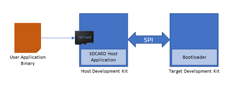

# Building and Running the SPI Bootloader applications

## Downloading and building the application

To clone or download this application from Github,go to the [main page of this repository](https://github.com/Microchip-MPLAB-Harmony/bootloader_apps_spi) and then click Clone button to clone this repo or download as zip file. This content can also be download using content manager by following [these instructions](https://github.com/Microchip-MPLAB-Harmony/contentmanager/wiki)

Path of the application within the repository is **apps/spi_bootloader/**

To build the application, refer to the following table and open the project using its IDE.

### Bootloader Application

| Project Name      | Description                                    |
| ----------------- | ---------------------------------------------- |
| bootloader/firmware/wbz451_curiosity.X    | MPLABX Project for [WBZ451 Curiosity Development Board](https://www.microchip.com/en-us/development-tool/ev96b94a)|

### Test Application

| Project Name      | Description                                    |
| ----------------- | ---------------------------------------------- |
| test_app/firmware/wbz451_curiosity.X    | MPLABX Project for [WBZ451 Curiosity Development Board](https://www.microchip.com/en-us/development-tool/ev96b94a)|

## Setting up [WBZ451 Curiosity Development Board](https://www.microchip.com/en-us/development-tool/ev96b94a)

- [SAME54 Xplained Pro Evaluation Kit](https://www.microchip.com/en-us/development-tool/atsame54-xpro) is used for **Host Development kit**

- [WBZ451 Curiosity Development Board](https://www.microchip.com/en-us/development-tool/ev96b94a) is used for **Target Development kit**

    

- Connect the MOSI Pin 16 (PC04) on EXT2 of the **Host development kit** to the MOSI Pin on J04 header of the **Target development kit**
- Connect the MISO Pin 17 (PC07) on EXT2 of the **Host development kit** to the MISO Pin on J04 header of the **Target development kit**
- Connect the CS Pin 15 (PC06) on EXT2 of the **Host development kit** to the CS Pin on J04 header of the **Target development kit**
- Connect the SCK Pin 18 (PC05) on EXT2 of the **Host development kit** to the SCK Pin  on J04 header of the **Target development kit**
- Connect the BUSY Pin 09 (PD00) on EXT2 of the **Host development kit** to the Pin 02 (PC14) on J04 header of the **Target development kit**
- Connect a ground wire between Host development kit and Target development kit
- Connect the Debug USB port on the Host development kit to the computer using a micro USB cable
- Connect the Debug USB port on the Target development kit to the computer using a micro USB cable

## Building and Configuring SPI Host Applications

### **Using SPI SDCARD Host application to send the application binary to Target development kit**

If the SDCARD Host Development Kit being used is [SAM E54 Xplained Pro Evaluation Kit](https://www.microchip.com/developmenttools/ProductDetails/atsame54-xpro) then follow the steps mentioned in [Configuring SDCARD Host application project](../../spi_bootloader/docs/readme_configure_host_app_sdcard.md#configuring-the-sdcard-host-application)

1. Open the SDCARD host application project *host_app_sdcard/firmware/sam_e54_xpro.X* in the IDE
    - If a SDCARD host application project of different development kit is used then open that project in the IDE
2. Build and program the SDCARD host application using the IDE on to the SPI host dvelopment kit

3. Open the test application project *test_app/firmware/wbz451_curiosity.X* in the IDE
4. Build the project to generate the binary **(Do not program the binary)**

5. Copy the application binary into the SD card and insert the SD card in the SD card slot available on the  [SAM E54 Xplained Pro Evaluation Kit](https://www.microchip.com/developmenttools/ProductDetails/atsame54-xpro) 

6. Open the Terminal application (Ex.:Tera Term) on the computer
7. Configure the serial port settings for **Host Development kit** as follows:
    - Baud : 115200
    - Data : 8 Bits
    - Parity : None
    - Stop : 1 Bit
    - Flow Control : None

8. Jump to [Running The Application](#running-the-application)

## Running the Application

1. Open the bootloader project *bootloader/firmware/wbz451_curiosity.X* in the IDE
2. Build and program the application using the IDE on to the **Target development kit**

3. **If the test application is being programmed**, Open the Terminal application (Ex.:Tera Term) on the computer and configure the serial port settings for **Target Development kit** as follows:
    - Baud : 115200
    - Data : 8 Bits
    - Parity : None
    - Stop : 1 Bit
    - Flow Control : None

4. Press the Switch **SW0** on the Host development kit to trigger programming of the application binary
5. Once the programming is complete,
    - **LED0** on the Host development kit will be turned on indicating success

    - The target development kit will be reset. Upon re-start, the boot-loader will jump to the user application

    - If the test application is programmed then **RGB_LED_GREEN** should start blinking and you should see below output on the **Target development kit** console

        

6. Press and hold the Switch **S1** to trigger Bootloader from test application and you should see below output

    

7. Press Reset button on the Host development kit to reprogram the application binary
8. Repeat Steps 4-5 once
    - This step is to verify that bootloader is running after triggering bootloader from test application in Step 6

## Additional Steps (Optional)

### Using SDCARD Host application

- If multiple Target development kit are to be programmed using the same Host development kit then refer to [Configuring SDCARD Host application project](../../spi_bootloader/docs/readme_configure_host_app_sdcard.md)

- Once done repeat the applicable steps mentioned in [Running The Application](#running-the-application)

