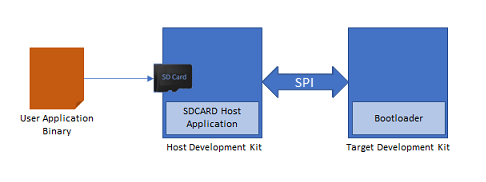

To clone or download this application from Github,go to the [main page of this repository](https://github.com/Microchip-MPLAB-Harmony/bootloader_apps_i2c) and then click Clone button to clone this repo or download as zip file. This content can also be download using content manager by following [these instructions](https://github.com/Microchip-MPLAB-Harmony/contentmanager/wiki)

# SPI Bootloader

This example application shows how to use the Bootloader Library to bootload an application using SPI protocol.

### Bootloader Application

- This is a bootloader application which resides from starting location of the device flash memory
- It uses SPI peripheral library in non-interrupt mode
- Trigger Methods
    - It uses the On board Switch as bootloader trigger pin to force enter the bootloader at reset of device
    - It checks for bootloader request pattern **(0x5048434D)** from the starting 16 Bytes of RAM to force enter bootloader at reset of device

### SDCARD Host Application

- This is a embedded SPI host application which sends the application image stored in the SD card to the target board over the SPI communication
- The user application binary is copied into an SD card and inserted in the SD card connected on the host board

    

### Test Application

- This is a test application which resides from end of bootloader size in device flash memory
- It will be loaded into flash memory by bootloader application
- It blinks an LED and provides console output
- It uses the On board Switch to trigger the bootloader from firmware **(May not be supported on all devices)**
    - Once the switch is pressed it loads first 16 bytes of RAM with bootloader request pattern **(0x5048434D)** and resets the device

## Development Kits
The following table provides links to documentation on how to build and run SPI bootloader on different development kits

| Development Kit |
|:---------|
|[PIC32MM USB Curiosity Development Kit](docs/readme_pic32mm_usb_curiosity.md) |
|[SAM D21 Xplained Pro Evaluation Kit](docs/readme_sam_d21_xpro.md) |
|[SAM E54 Xplained Pro Evaluation Kit](docs/readme_sam_e54_xpro.md) |
|[SAM E70 Xplained Pro Evaluation Kit](docs/readme_sam_e70_xpro.md) |