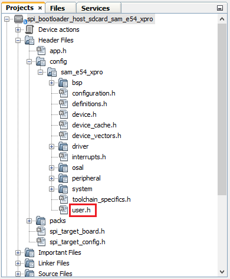

# Configuring the SDCARD Host applications

Path of the SDCARD host applications within the repository is **apps/spi\_bootloader/**

**Configuring the SDCARD Host application**

**Follow below steps only when Host development kit is different than Target Development Kit**

1.  Open the host\_app\_sdcard/firmware/\*.X project in MPLABX IDE

2.  Open the "user.h" file as shown below:

    

3.  In the "user.h" file specify the Bootloader Target Device used using the predefined macros \#define APP\_SPI\_BOOTLOADER\_TARGET\_DEVICE SAM\_D21\_XPRO

    

4.  Navigate to the **\#if block** for the specified **Bootloader Target Device** and verify the below settings are as expected.

    -   **APP\_BINARY\_FILE:** Name of the Application binary copied to the SDCARD

    -   **APP\_ERASE\_PAGE\_SIZE:** Erase page size of the target \(target = MCU being programmed\)

    -   **APP\_PROGRAM\_PAGE\_SIZE:** Program page size of the target \(target = MCU being programmed\).

        -   The macro can either be set to the program page size or can be set to the size of the erase page size of the target.

        -   In the demo example, the macro is set equal to the size of the erase page.

        -   On embedded host where RAM is limited, the macro may be set to the actual program page size to reduce the RAM used to hold the program data.

            -   For example, for SAM D20, the macro can be set either to 64 \(program page size\) or 256 \(erase page size\)

    -   **APP\_IMAGE\_START\_ADDR:** User application start address \(This value should be same as the application start address specified in Application Configurations steps\).

        -   If the bootloader itself is being upgraded then the APP\_IMAGE\_START\_ADDR must be set to 0x00 \(start of bootloader\)

        -   Ensure that the bootloader and application are also configured with the same value of user application start address

**Parent topic:**[Configuring a Host Application used to send an application binary to bootloader](GUID-763ED268-8522-4DFA-960B-9FB891C16E7D.md)

