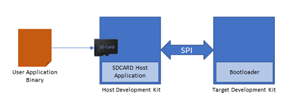

# SPI Bootloader

This example application shows how to use the Bootloader Library to bootload an application using SPI protocol.

**Bootloader Application**

-   This is a bootloader application which resides from starting location of the device flash memory

-   It uses SPI peripheral library in non-interrupt mode

-   Trigger Methods

    -   It uses the On board Switch as bootloader trigger pin to force enter the bootloader at reset of device

    -   It checks for bootloader request pattern **\(0x5048434D\)** from the starting 16 Bytes of RAM to force enter bootloader at reset of device

**SDCARD Host Application**

-   This is a embedded SPI host application which sends the application image stored in the SD card to the target board over the SPI communication

-   The user application binary is copied into an SD card and inserted in the SD card connected on the host board

    

**Test Application**

-   This is a test application which resides from end of bootloader size in device flash memory

-   It will be loaded into flash memory by bootloader application

-   It blinks an LED and provides console output

-   It uses the On board Switch to trigger the bootloader from firmware **\(May not be supported on all devices\)**

    -   Once the switch is pressed it loads first 16 bytes of RAM with bootloader request pattern **\(0x5048434D\)** and resets the device

**Development Kits** The following table provides links to documentation on how to build and run SPI bootloader on different development kits

-   **[PIC32CZ-CA80 Curiosity Ultra board: Building and Running the SPI Bootloader applications](GUID-5F6F4826-72AB-48C4-AB1B-047FBE75962F.md)**  

-   **[PIC32MM USB Curiosity Development Board: Building and Running the SPI Bootloader applications](GUID-F31ADF79-A83B-48F5-B5ED-396C3BE2DAAB.md)**  

-   **[SAM D21 Xplained Pro Evaluation Kit: Building and Running the SPI Bootloader applications](GUID-3D765FF2-5914-4F68-BEFE-5466CC87F6D4.md)**  

-   **[SAM E54 Xplained Pro Evaluation Kit: Building and Running the SPI Bootloader applications](GUID-8073239D-25B8-476C-B8C5-7509893077D8.md)**  

-   **[SAM E70 Xplained Ultra Kit: Building and Running the SPI Bootloader applications](GUID-632A5121-5E25-4E37-A769-788DE18593A0.md)**  

-   **[WBZ451 Curiosity Development Board: Building and Running the SPI Bootloader applications](GUID-2E33F91D-2A12-420F-8C61-85F838833679.md)**  

**Parent topic:**[MPLAB® Harmony 3 SPI Bootloader Application Examples](GUID-45C824DC-882D-4B29-90F2-5626642DF953.md)

